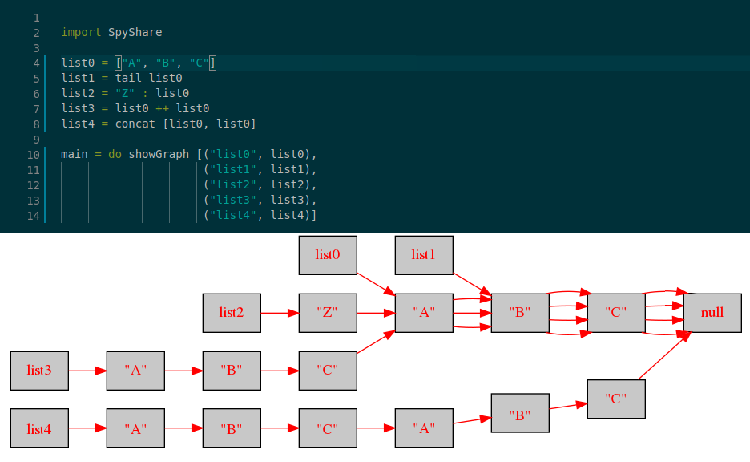

# spyshare
A tiny tool for visualising sharing between Haskell data structures

🔍 SPYSHARE 🔍
=========================

### 🔍 Graphvis and StableNames unveil shared structure

Spyshare generates a graph-based visualization of composite data structures in Haskell. It uses StableName (and hence unsafePerformIO) to track actual memory locations, and can thus be used to visualize substructural sharing, as in the above screenshot. Out of the box, spyshare works only on lists, but it is rudimentarily abstractble (via its MemMappable typeclass) to permit easy extension to some ADTs, like the binary trees below:

I made this as a personal utility when I was doing research on variational data structures with Ramy Shanin. It's barebones, but could likely be straightforwardly extended into a useful didactic tool

### 🔍 Installation and Usage Instructions

- Requires Graphvis, StableName
- Import SpyShare and call showGraph on a list of pairs where the first elements are labels (Strings) and the second elements are identifiers representing the structures to be visualized.
- A png-format image will be created in the working directory. In linux, the image will open automatically, provided there's an application installed which can handle PNFGs
- Untamed unsafeness warning: keep programs simple to avoid confusing results
